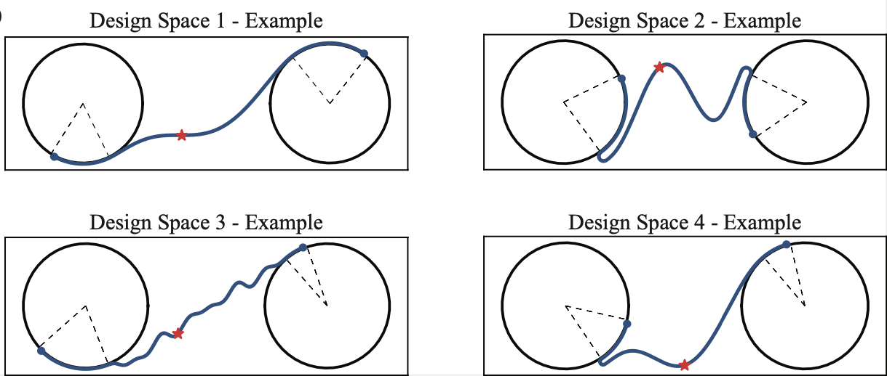

# Machine Learning-Guided Design of Non-Reciprocal and Asymmetric Elastic Chiral Metamaterials

This repository contains the code for the following paper:

> Lingxiao Yuan, Harold Park\*, Emma Lejeune\*
>
> [Machine Learning-Guided Design of Non-Reciprocal and Asymmetric Elastic Chiral Metamaterials](link)
>
> 


## Details 

`chiral_singleObj`
* `configs/configs_default.py` : The configuration file for single objective optimization
* `main.py` : The main file that controls work flow of single objective optimization


`chiral_multiObj`
* `configs/configs_default.py` : The configuration file for multi objective optimization
* `main.py` : The main file that controls work flow of multi-objective optimization


`networks`
* `NNs.py` : The base model for the ensemble learning


`tools`
* `arm0_design.py` : Generate geometries for design space 1 
* `arm1_design.py` : Generate geometries for design space 2
* `arm2_design.py` : Generate geometries for design space 3
* `arm3_design.py` : Generate geometries for design space 4
* `arm3_tools_aug.py` : Generate augmented geometries for design space 3
* `data_processing.py` : Functions for processing data
* `helpers.py` : Functions for data visualization
* `lig_space.py` : The base function for ligament shape design
* `runlib.py.py` : Functions for model training and predicting 

To generate example for design space 1 to design space 4 , run the follow command:

```bash
>>python arm0_design.py
>>python arm1_design.py
>>python arm2_design.py
>>python arm3_design.py
```

<p>

</p>

`Abaqus`
This folder contains scripts for Abaqus simulation

* `scripts/FEmodel.py` : The script for creating Finite Element Model for geometries in design space 1 and design space 3
* `scripts/FEmodel_arm1.py` : The script for creating Finite Element Model for geometries in design space 2
* `scripts/FEmodel_arm3.py` : The script for creating Finite Element Model for geometries in design space 4
* `scripts/main_1step.py` : The main script to submit FEA simulation job for geometries in design space 1
* `scripts/main_1step_arm1.py` : The main script to submit FEA simulation job for geometries in design space 2
* `scripts/main_1step_arm2.py` : The main script to submit FEA simulation job for geometries in design space 3
* `scripts/main_1step_arm3.py` : The main script to submit FEA simulation job for geometries in design space 4
* `scripts/sensitivity_analysis.py` : Generate examples for mesh sensitivity analysis

## Hypermeters 
Below are the parameters to choose for the main.py in folder `chiral_multiObj` and `chiral_multiObj`. All other hyperparameters are saved in config files. 

* `objective`: objective to optimization
  
  rule of objective name: 'xy0yx1' denotes kxy-/kyx+, 'xx0xx1xy0yx1' denotes multi objectives kxx-/kxx+ and kxy-/kyx+
* `mode`: the name for the optimization steps, choices = ["collect_data","sampling","train", "select","next_simulation","next"]
* `it`: the iteration number, it>=0


## Steps to reproduce the results (on BU's SCC)
* Step1: get initial samples
```bash
#enter the folder Abaqus
>>cd Abaqus
#get the geometry parameters for chiral designs, go to folder Abaqus
>>python initial_samples.py
#get input files for Abaqus
>>sh multiinput.sh   
#run finite element simulation using Abaqus on BU SCC platform
>>sh multisubjob.sh   
#extract data from Abaqus FEM simulation results
>>sh multioutput.sh   
```

* Step2: optimization iterations
```bash
#enter the workpath
>>cd chiral_singleObj    #change this to "cd chiral_multiObj" for multi-objectives optimization
# generatethe design pools, our design pool contains 100,000 design for each design spaces, this parameter are set in config files
>>python main.py --mode=sampling
#conduct optimization on BU SCC platform 
>>sh jobcontrol.sh
```


